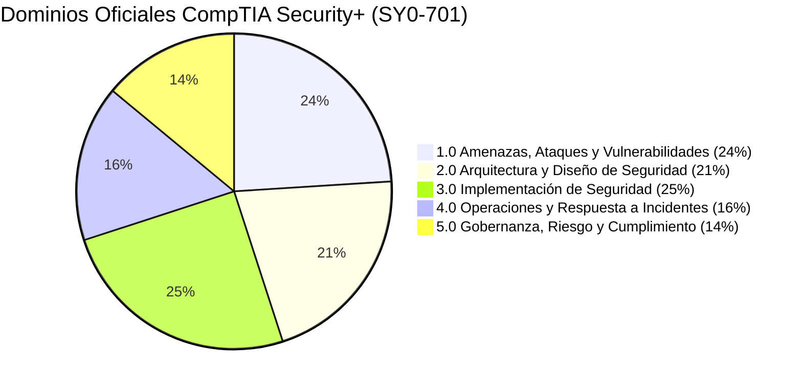

# Formación & Certificaciones

  UTN FRM
  CompTIA Security+ (En Preparación)
  Cisco Networking Academy
  Desarrollo Profesional

---

## Certificaciones en Preparación

### CompTIA Security+ (Examen SY0-701)

  Objetivo Activo · En Estudio

Actualmente me encuentro en proceso de preparación y estudio intensivo para rendir la certificación internacional **CompTIA Security+ (SY0-701)**, enfocada en consolidar y validar competencias técnicas en seguridad de la información, protección de infraestructura y operaciones de seguridad.

#### Ejes Principales de Estudio:
* **Amenazas y Vulnerabilidades:** Identificación de vectores de ataque en redes, ingeniería social y amenazas a aplicaciones.
* **Arquitectura y Diseño:** Principios de *Zero Trust*, microsegmentación de red, zonas DMZ y protocolos criptográficos seguros.
* **Implementación Práctica:** Configuración de controles de acceso (RBAC, RADIUS), seguridad en endpoints y hardening de sistemas operativos.
* **Operaciones y Monitoreo:** Triaje de eventos, análisis de logs en SIEM y procedimientos de contención de incidentes.

---

## Formación Académica

### Universidad Tecnológica Nacional (UTN - FRM)
**Ingeniería en Sistemas de Información**  
*Mendoza, Argentina · 2020 – Presente (5.º Año - Cursando)*

* Formación integral en arquitectura de software, bases de datos relacionales, sistemas operativos, redes y telecomunicaciones, modelado de procesos y gestión de proyectos tecnológicos.

---

## Formación Técnica Complementaria

### Cisco Networking Academy
**Curso Técnico en Fundamentos de Redes (CCNA)**  
*2024 – 2025*

* Fundamentos teóricos y prácticos de conmutación LAN (*Switching 802.1Q, STP, EtherChannel*), enrutamiento IP (*Routing estático y dinámico OSPF*), listas de control de acceso (ACLs) y mitigación de ataques en capa 2.
