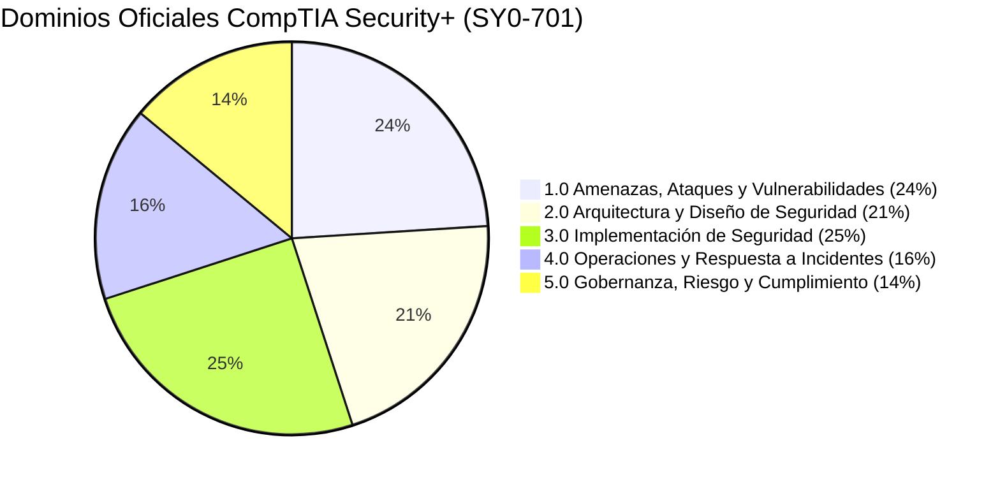

# Formación & Certificaciones

Trayectoria académica universitaria, hoja de ruta de certificaciones internacionales y especializaciones técnicas:

---

## Certificación en Preparación: CompTIA Security+ (SY0-701)

  

    

      Objetivo Activo · Examen 2026
      <h3 class="eng-project-title">CompTIA Security+ (SY0-701)</h3>
    

  

  

    Preparación teórica y práctica orientada a validar competencias en evaluación de postura de seguridad, aseguramiento de infraestructuras empresariales híbridas, respuesta a incidentes y cumplimiento normativo.
  

```mermaid
pie title Dominios Oficiales CompTIA Security+ (SY0-701)
    "1.0 Amenazas, Ataques y Vulnerabilidades (24%)" : 24
    "2.0 Arquitectura y Diseño de Seguridad (21%)" : 21
    "3.0 Implementación de Seguridad (25%)" : 25
    "4.0 Operaciones y Respuesta a Incidentes (16%)" : 16
    "5.0 Gobernanza, Riesgo y Cumplimiento (14%)" : 14
```

  <h4 style="font-size: 0.95rem; font-weight: 650; margin-top: 1.5rem; margin-bottom: 0.6rem; color: var(--site-text-primary);">Desglose por Dominios de Examen:</h4>
  <ul class="eng-specs-list">
    <li><strong>1.0 Amenazas, Ataques y Vulnerabilidades:</strong> Identificación de vectores de ataque en redes, ingeniería social, malware, vulnerabilidades en aplicaciones y entornos cloud.</li>
    <li><strong>2.0 Arquitectura y Diseño:</strong> Principios de <em>Zero Trust</em>, microsegmentación de red, zonas DMZ, criptografía aplicada (PKI, TLS, SSH) y resiliencia de servicios.</li>
    <li><strong>3.0 Implementación Práctica:</strong> Controles de acceso basados en roles (RBAC), gestión de identidades, directivas de seguridad en Windows/Linux y protección perimetral.</li>
    <li><strong>4.0 Operaciones y Respuesta:</strong> Monitoreo de alertas, análisis forense de tráfico con Wireshark, diagnóstico de red y continuidad operativa.</li>
    <li><strong>5.0 Gobernanza, Riesgo y Cumplimiento:</strong> Gestión de riesgos tecnológicos, marcos de seguridad y políticas organizacionales.</li>
  </ul>

---

## Formación Académica Universitaria

  

    <h3 class="exp-role">Ingeniería en Sistemas de Información</h3>
    2020 – Presente (5.º Año · En curso)
  

  
Universidad Tecnológica Nacional — Facultad Regional Mendoza (UTN FRM)

  

    Formación universitaria de grado con foco en arquitectura de redes de datos, sistemas operativos, bases de datos relacionales, ingeniería de software y administración de proyectos tecnológicos.
  

  

    UTN FRM
    Ingeniería en Sistemas
    5.º Año
    Mendoza, Argentina
  

---

## Cursos Técnicos & Formación Continua

  

    <h4 class="skill-card-title">Cisco Networking Academy</h4>
    

      Fundamentos de Redes (CCNA) · 2024 – 2025
    

    

      Conmutación multicapa (VLANs 802.1Q, STP), enrutamiento estático e inter-VLAN, direccionamiento IPv4/IPv6 y configuración de listas de control de acceso (ACLs).
    

  

  

    <h4 class="skill-card-title">TryHackMe: Cyber Security 101</h4>
    

      Ruta de Aprendizaje Completada · 2025 – 2026
    

    

      Fundamentos de redes y protocolos, principios de criptografía, inspección de tráfico con Wireshark, seguridad en Linux/Windows y conceptos fundamentales.
    

  

  

    <h4 class="skill-card-title">TryHackMe: SOC Level 1</h4>
    

      En Formación Activa (Laboratorios Prácticos) · 2026
    

    

      Ruta de formación práctica en curso sobre metodologías de defensa, análisis forense de paquetes de red y respuesta a eventos en laboratorio.
    

  

  

    <h4 class="skill-card-title">Liceo Militar General Espejo</h4>
    

      Bachiller en Ciencias Sociales · 2012 – 2019
    

    

      Formación secundaria con énfasis en disciplina, trabajo colaborativo bajo presión y responsabilidad cívica.
    

  

