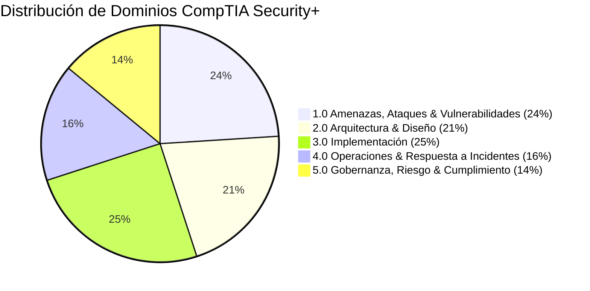

# CompTIA Security+ — Notas de Estudio & Dominios Clave

  CompTIA Security+
  Certificación Internacional
  En Preparación (2026)

## Hoja de Ruta de Certificación

La certificación **CompTIA Security+ (SY0-701)** es el estándar internacional de la industria para validar las competencias operativas fundamentales en seguridad de redes, gestión de riesgos y respuesta ante amenazas.

---

## Desglose de Dominios de Examen

### Dominio 1.0: Amenazas, Ataques & Vulnerabilidades
* Tipos de actores de amenaza (*Nation-state, Hacktivists, Insider threats, Script kiddies*).
* Vectores de ataque social (*Phishing, Spear Phishing, Whaling, Vishing, Smishing*).
* Ataques a nivel de red (*Man-in-the-Middle, DNS Spoofing, DDoS amplification, ARP Poisoning*).

### Dominio 2.0: Arquitectura & Diseño de Seguridad
* Principios de **Zero Trust** (*Never trust, always verify*).
* Microsegmentación de redes y zonas DMZ.
* Protocolos seguros vs inseguros (HTTPS sobre HTTP, SSH sobre Telnet, SFTP sobre FTP, DNSSEC sobre DNS).

### Dominio 3.0: Criptografía & PKI
* Algoritmos de cifrado simétrico (AES-GCM, ChaCha20) y asimétrico (RSA, ECC).
* Infraestructura de Clave Pública (CA, certificados X.509, listas de revocación CRL y protocolo OCSP).
* Hashing y verificación de integridad (SHA-256, SHA-3).
