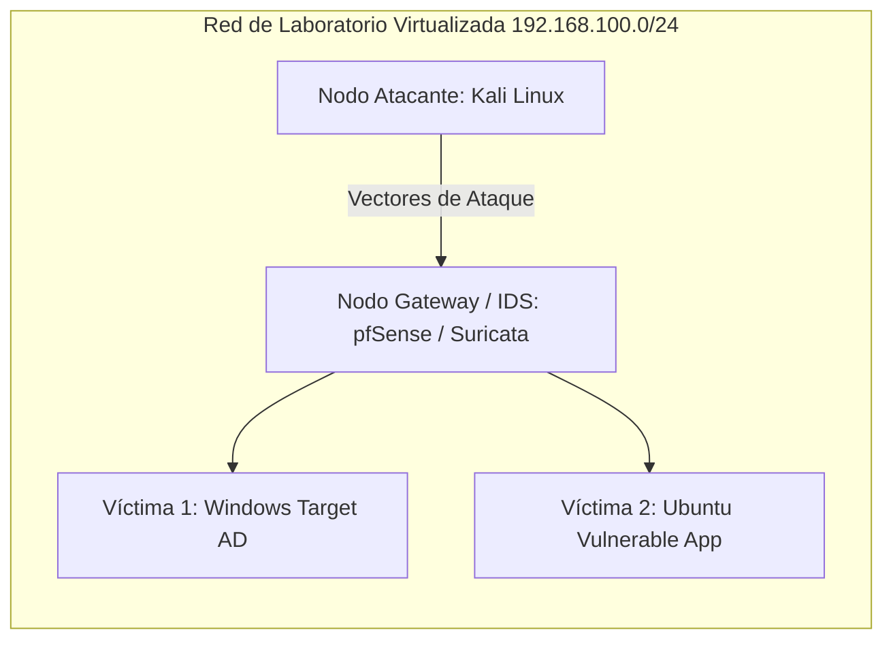

# 🟣 Laboratorio Práctico: Simulación Purple Team en Entornos Aislados

<div style="display: flex; gap: 8px; margin-bottom: 20px;">
  <span class="badge-tag">Purple Team</span>
  <span class="badge-tag">GNS3</span>
  <span class="badge-tag">Docker Labs</span>
  <span class="badge-tag">Hardening</span>
</div>

## 📌 ¿Por qué la Metodología Purple Team?

El enfoque **Purple Team** integra la perspectiva del atacante (Red Team) y la del defensor (Blue Team) en un ciclo de retroalimentación continuo. En lugar de limitarse a auditorías esporádicas, se prueban controles defensivos reales contra técnicas tácticas conocidas.

---

## 🏗️ Topología del Laboratorio de Pruebas

Para realizar simulaciones seguras sin riesgo de afectar redes de producción, se implementó un entorno virtualizado sobre **GNS3** y contenedores **Docker**:



---

## 🎯 Ejercicios Simulados & Respuestas Defensivas

### Caso 1: Detección y Mitigación de Escaneos de Red (Port Scanning)
* **Acción Ofensiva:** Escaneo `nmap -sS -A` desde el nodo Kali para enumerar servicios y versiones.
* **Respuesta Defensiva:**
    * Monitoreo de reglas en el firewall gateway.
    * Configuración de *Rate Limiting* y bloqueo temporal automático de IPs que generen más de 20 paquetes `SYN` a puertos cerrados por segundo.

### Caso 2: Ataque de Fuerza Bruta SSH y Protección con Fail2ban
* **Acción Ofensiva:** Simulación de ataque por diccionario hacia el servidor SSH.
* **Respuesta Defensiva:**
    * Instalación y ajuste de `fail2ban` con política estricta:
    ```ini
    [sshd]
    enabled = true
    port = 2222
    maxretry = 3
    findtime = 600
    bantime = 3600
    ```
    * Bloqueo inmediato a nivel de tabla `iptables` tras el tercer intento erróneo.
