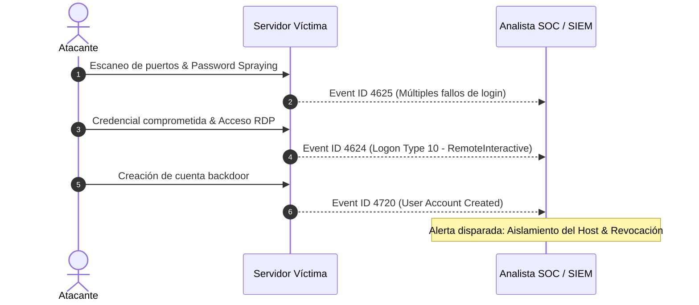

# 🔍 TryHackMe: SOC Level 1 (Análisis de Tráfico, Logs & SIEM)

<div style="display: flex; gap: 8px; margin-bottom: 20px;">
  <span class="badge-tag">TryHackMe</span>
  <span class="badge-tag">SOC Level 1</span>
  <span class="badge-tag">Wireshark & Packet Analysis</span>
  <span class="badge-tag">Incident Response</span>
</div>

## 📌 Enfoque de la Ruta SOC Level 1

La ruta **SOC Level 1** profundiza en las habilidades operativas de un analista de centro de operaciones de seguridad (SOC): monitoreo de alertas, análisis de tráfico de red malicioso, triaje de incidentes e investigación forense inicial.

* **Estado:** ⏳ En curso (2026)
* **Áreas Clave:** Análisis de tráfico de red, herramientas SIEM, Endpoint Detection & Response (EDR) y Threat Intelligence.

---

## 🧪 Laboratorios Prácticos Destacados

### 1. Análisis Forense de Tráfico con Wireshark

Investigación de capturas `.pcap` para identificar patrones de tráfico anómalo, exfiltración de datos y ataques de denegación de servicio:

```wireshark
# Filtros de visualización Wireshark comunes utilizados en labs:

# 1. Detectar intentos de fuerza bruta HTTP POST
http.request.method == "POST" && http contains "login"

# 2. Filtrar transferencias de zona DNS no autorizadas
dns.flags.opcode == 0 && dns.qry.type == 252

# 3. Identificar conexiones TLS sospechosas por SNI (Server Name Indication)
tls.handshake.extensions_server_name contains "evil-domain"

# 4. Localizar tráfico TCP con flag RST (conexiones rechazadas/escaneos)
tcp.flags.reset == 1 && tcp.seq == 1
```

### 2. Detección de Ataques en Logs de Windows

Mapeo de eventos según el framework **MITRE ATT&CK**:



---

## 💡 Metodología de Triaje de Incidentes

1. **Identificación & Verificación:** Comprobación de si la alerta es un falso positivo o un incidente real mediante correlación de fuentes (logs del firewall + logs del endpoint).
2. **Contención Inicial:** Aislamiento lógico del host afectado de la red corporativa mediante VLAN de cuarentena o reglas de firewall dinámicas.
3. **Erradicación & Lecciones:** Identificación del vector de entrada (phishing, credencial débil, servicio desactualizado) y ajuste de reglas de detección.
