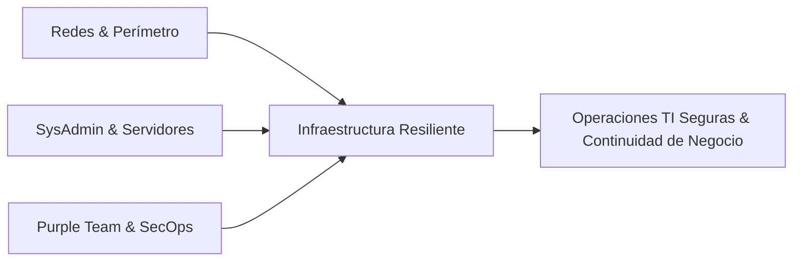

# 🛡️ Juan Francisco Vazquez — Knowledge Base & Technical Labs

  UTN FRM - 5to Año Ing. Sistemas
  MikroTik & Ubiquiti
  Active Directory & Windows Server
  Linux & Docker
  Purple Team & SecOps

Bienvenido a mi **documentación técnica, bitácora de laboratorios y portafolio de ingeniería**. Este espacio está dedicado a registrar arquitecturas de red implementadas en producción, writeups de ciberseguridad (TryHackMe), guías de hardening de servidores y proyectos de software.

  <a href="assets/CV-Juan-Francisco-Vazquez.pdf" target="_blank" download class="btn-cv">
    📄 Descargar CV en PDF Oficial
  </a>

---

## 🎯 Perfil y Enfoque Profesional

Soy estudiante avanzado de **Ingeniería en Sistemas de Información (5.º año en UTN FRM)** en Mendoza, Argentina. Cuento con experiencia laboral administrando infraestructura de red corporativa, servidores Windows/Linux, servicios contenerizados y soporte N2/N3. 

Mi foco principal de especialización se encuentra en la intersección entre **Infraestructura de Redes**, **Administración de Sistemas** y **Ciberseguridad Aplicada (metodología Purple Team)**.

---

## 🧭 Estructura del Portafolio Técnico

Explorá la documentación organizada por dominios técnicos:

### 🌐 [Redes & Infraestructura Corporativa](redes-infra/topologia-corporativa-cpce.md)
* **[Topología Corporativa CPCE](redes-infra/topologia-corporativa-cpce.md):** Arquitectura con MikroTik, Ubiquiti, segmentación en VLANs y túneles seguros OpenVPN.
* **[Active Directory & GPO Hardening](redes-infra/active-directory-gpo-hardening.md):** Controladores de dominio en Windows Server, políticas de grupo y servidores DNS.
* **[Linux Server & Docker Labs](redes-infra/infraestructura-linux-docker.md):** Despliegue de servicios en Ubuntu Server y ambientes de pruebas contenerizados.

### 🛡️ [Ciberseguridad & Purple Team](ciberseguridad-purple-team/thm-cyber-security-101.md)
* **[TryHackMe: Cyber Security 101 Writeups](ciberseguridad-purple-team/thm-cyber-security-101.md):** Fundamentos ofensivos, defensivos, criptografía y redes (Ruta completada).
* **[TryHackMe: SOC Level 1 Labs](ciberseguridad-purple-team/thm-soc-level-1.md):** Análisis de paquetes con Wireshark, investigación de tráfico sospechoso y monitoreo de logs.
* **[Laboratorio Purple Team en Docker/GNS3](ciberseguridad-purple-team/lab-purple-team-simulacion.md):** Simulación controlada de vectores de ataque y hardening de endpoints.

### 🚀 [Proyectos de Software](proyectos/syscow-gestion-agropecuaria.md)
* **[Syscow (Tesis de Grado UTN)](proyectos/syscow-gestion-agropecuaria.md):** Plataforma agropecuaria integral con Python backend, modelado de bases de datos y arquitectura modular.
* **[Backend de Salud Digital (RST)](proyectos/rst-salud-digital.md):** Pasantía en endpoints RESTful y optimización de consultas SQL.

### 📜 [Certificaciones & Hoja de Ruta](certificaciones/comptia-security-plus.md)
* **[CompTIA Security+ Study Notes](certificaciones/comptia-security-plus.md):** Resumen de conceptos y dominios clave en preparación para el examen.
* **[Cisco Networking Academy](certificaciones/cisco-networking-academy.md):** Fundamentos técnicos de redes y conmutación.

---

## 📬 Contacto Rápido

* **Email:** [vazquezjuanfrancisco49@gmail.com](mailto:vazquezjuanfrancisco49@gmail.com)
* **LinkedIn:** [linkedin.com/in/juan-francisco-vazquez-0aaa94218](https://linkedin.com/in/juan-francisco-vazquez-0aaa94218)
* **GitHub:** [github.com/Jusnock](https://github.com/Jusnock)
* **Ubicación:** Mendoza, Argentina (Disponible presencial/híbrido en Mendoza o 100% remoto en español).
