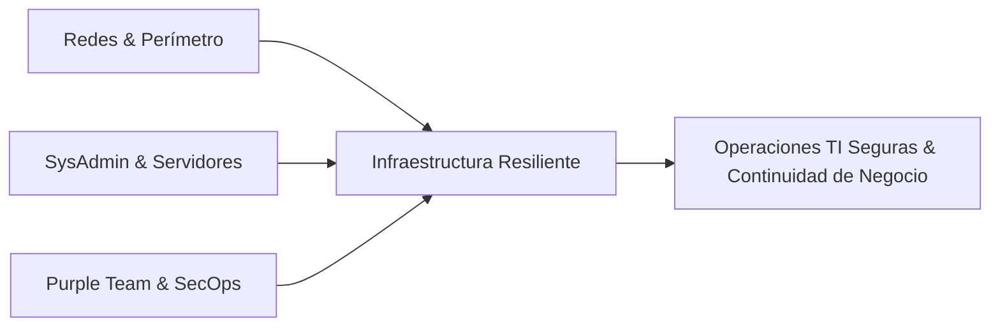

# Juan Francisco Vazquez — Documentación Técnica & Labs

  UTN FRM · 5to Año Ing. Sistemas
  MikroTik & Ubiquiti
  Active Directory & Windows Server
  Linux & Docker
  Purple Team & SecOps

Repositorio de documentación técnica, bitácora de laboratorios y casos de estudio de ingeniería. Este espacio documenta arquitecturas de red implementadas en entornos reales, writeups de ciberseguridad, procedimientos de hardening de servidores y desarrollo de software.

  <a href="assets/CV-Juan-Francisco-Vazquez.pdf" target="_blank" download class="btn-cv">
    Descargar CV en PDF
  </a>

---

## Perfil Profesional

Estudiante avanzado de **Ingeniería en Sistemas de Información (5.º año en UTN FRM)** en Mendoza, Argentina. Cuento con experiencia práctica en administración de infraestructura de red corporativa, servidores Windows/Linux, servicios contenerizados y soporte de segundo y tercer nivel (N2/N3).

El foco principal de especialización abarca la integración entre **Infraestructura de Redes**, **Administración de Sistemas (SysAdmin)** y **Ciberseguridad Aplicada (metodología Purple Team)**.

---

## Estructura de la Documentación

### [Redes & Infraestructura Corporativa](redes-infra/topologia-corporativa-cpce.md)
* **[Topología Corporativa CPCE](redes-infra/topologia-corporativa-cpce.md):** Arquitectura con MikroTik RouterOS, conmutación Ubiquiti UniFi, segmentación en VLANs y enlaces VPN seguros.
* **[Active Directory & Hardening GPO](redes-infra/active-directory-gpo-hardening.md):** Controladores de dominio Windows Server, diseño de OUs y políticas de grupo restrictivas.
* **[Servidores Linux & Docker](redes-infra/infraestructura-linux-docker.md):** Despliegue de servicios en Ubuntu Server y aislamiento contenerizado.

### [Ciberseguridad & Purple Team](ciberseguridad-purple-team/thm-cyber-security-101.md)
* **[TryHackMe: Cyber Security 101](ciberseguridad-purple-team/thm-cyber-security-101.md):** Fundamentos ofensivos, defensivos, criptografía y análisis de protocolos.
* **[TryHackMe: SOC Level 1](ciberseguridad-purple-team/thm-soc-level-1.md):** Inspección de paquetes en Wireshark, correlación de eventos y triaje de incidentes.
* **[Laboratorio de Simulación Purple Team](ciberseguridad-purple-team/lab-purple-team-simulacion.md):** Emulación de vectores de ataque en entornos controlados y mitigación activa.

### [Proyectos de Software](proyectos/syscow-gestion-agropecuaria.md)
* **[Syscow (Proyecto Integrador UTN)](proyectos/syscow-gestion-agropecuaria.md):** Plataforma agropecuaria integral con backend Python, modelado relacional SQL y control de acceso RBAC.
* **[Backend de Salud Digital (RST)](proyectos/rst-salud-digital.md):** Endpoints RESTful y optimización de consultas en base de datos de historias clínicas.

### [Certificaciones & Formación](certificaciones/comptia-security-plus.md)
* **[CompTIA Security+](certificaciones/comptia-security-plus.md):** Notas técnicas y mapa de dominios en preparación para el examen SY0-701.
* **[Cisco Networking Academy](certificaciones/cisco-networking-academy.md):** Fundamentos de conmutación, enrutamiento y seguridad de capa 2.

---

## Contacto

* **Email:** [vazquezjuanfrancisco49@gmail.com](mailto:vazquezjuanfrancisco49@gmail.com)
* **LinkedIn:** [linkedin.com/in/juan-francisco-vazquez-0aaa94218](https://linkedin.com/in/juan-francisco-vazquez-0aaa94218)
* **GitHub:** [github.com/Jusnock](https://github.com/Jusnock)
* **Ubicación:** Mendoza, Argentina (Disponible presencial/híbrido en Mendoza o 100% remoto).
