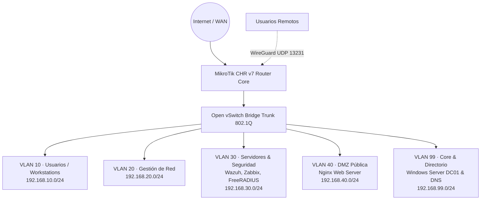
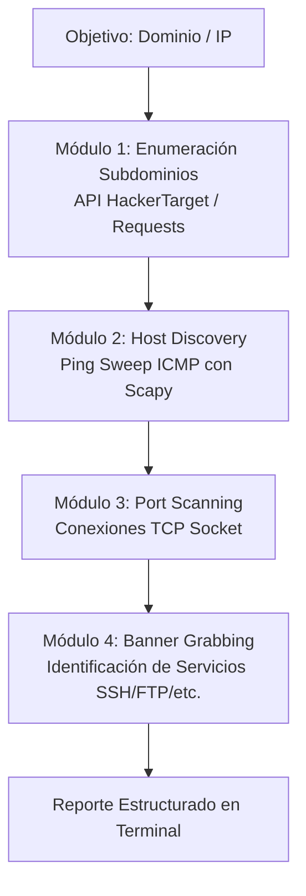

# Proyectos

---

## Diseño, Implementación y Seguridad de Red Empresarial Virtualizada

<div style="display: flex; gap: 8px; flex-wrap: wrap; margin-bottom: 20px;">
  <span class="badge-tag">GNS3</span>
  <span class="badge-tag">MikroTik RouterOS v7</span>
  <span class="badge-tag">Open vSwitch</span>
  <span class="badge-tag">Windows Server AD</span>
  <span class="badge-tag">Wazuh SIEM</span>
  <span class="badge-tag">Zabbix 7.0</span>
  <span class="badge-tag">FreeRADIUS</span>
  <span class="badge-tag">WireGuard VPN</span>
  <span class="badge-tag">Cowrie Honeypot</span>
</div>

<div style="margin: 20px 0;">
  <a href="../assets/Proyecto-Red-Memoria-Tecnica.pdf" target="_blank" download class="btn-cv">
    Descargar Memoria Técnica Completa (PDF · 38 Págs)
  </a>
</div>

### Resumen Ejecutivo

Proyecto integral de ingeniería enfocado en el diseño, despliegue, monitoreo y aseguramiento de una infraestructura de red empresarial multicapa completamente virtualizada sobre **GNS3** y **Open vSwitch (OVS)**, gobernada por un router central **MikroTik Cloud Hosted Router (CHR v7)**.

El proyecto abarca desde la segmentación lógica en VLANs y servicios de producción corporativos (Active Directory, DNS, Zabbix, FreeRADIUS) hasta capas de detección de intrusiones con **Wazuh SIEM**, tecnologías de engaño (*Cowrie Honeypot*) y acceso remoto seguro mediante **WireGuard**.

---

### Topología de Red y Segmentación

La red se estructuró en 5 zonas de seguridad lógicamente aisladas a nivel de enlace de datos (802.1Q) y filtradas mediante políticas de mínimo privilegio en el firewall del router:



#### Esquema de Direccionamiento y Roles

| Segmento | VLAN ID | Rango IP | Gateway | Propósito / Servicios |
|---|---|---|---|---|
| **Usuarios** | `VLAN 10` | `192.168.10.0/24` | `192.168.10.1` | Estaciones de trabajo de empleados corporativos |
| **Gestión** | `VLAN 20` | `192.168.20.0/24` | `192.168.20.1` | Segmento exclusivo de administración de red |
| **Servicios** | `VLAN 30` | `192.168.30.0/24` | `192.168.30.1` | Servidores Wazuh Manager, Zabbix 7.0 y FreeRADIUS |
| **DMZ** | `VLAN 40` | `192.168.40.0/24` | `192.168.40.1` | Servidor Web público (Nginx) expuesto vía DNAT |
| **Directorio** | `VLAN 99` | `192.168.99.0/24` | `192.168.99.1` | Controlador de Dominio (Windows Server DC01) y DNS |
| **VPN** | `wg-vpn` | `10.0.0.0/24` | `10.0.0.1` | Clientes remotos con túnel cifrado WireGuard |

---

### Módulos Técnicos Implementados

#### 1. Conmutación y Enrutamiento (Open vSwitch + MikroTik CHR)
* Creación de puente virtual OVS con soporte para etiquetado **IEEE 802.1Q**.
* Configuración de interfaces VLAN, servidores DHCP dedicados por segmento y tablas de enrutamiento inter-VLAN en MikroTik RouterOS v7.
* Implementación de reglas de **NAT Masquerade** hacia WAN y política por defecto *Drop All* en la cadena forward.

#### 2. Servicios Corporativos de Identidad y Acceso
* **Active Directory Domain Services (AD DS):** Despliegue de Windows Server DC01, diseño de árbol de Unidades Organizativas (OUs), altas de usuarios y grupos por departamento.
* **DNS Corporativo:** Resolución de nombres internos para el dominio corporativo y reenviadores condicionales (*DNS Forwarders*) a Internet.
* **Autenticación Centralizada FreeRADIUS:** Servidor RADIUS en Ubuntu Server para autenticar accesos de red y credenciales de gestión de dispositivos.

#### 3. Monitoreo y Visibilidad de Infraestructura
* **Zabbix 7.0 LTS:** Monitorización centralizada de salud de red y servidores mediante agentes Zabbix y consultas SNMPv2/v3 hacia el core router MikroTik.
* **WinGate Proxy HTTP:** Control y registro de navegación web para las estaciones de trabajo de usuarios.

#### 4. Seguridad Defensiva, SIEM y Deception
* **Wazuh SIEM:** Despliegue de Wazuh Manager en Ubuntu Server con agentes desplegados en endpoints Windows y Linux para recolección de eventos en tiempo real.
* **Reenvío de Logs Syslog (MikroTik -> Wazuh):** Configuración de acciones de registro en RouterOS para enviar alertas de firewall por UDP 514 al SIEM.
* **Cowrie Honeypot:** Despliegue de honeypot interactivo emulando servicios SSH/Telnet para captura y análisis de ataques de fuerza bruta y comandos ejecutados por atacantes.

#### 5. Publicación en DMZ y Acceso Remoto con WireGuard
* **Aislamiento de DMZ:** Servidor Nginx en VLAN 40 con redirección de puertos (DNAT tcp/80) y regla de bloqueo explícita hacia las subredes internas.
* **Túnel VPN WireGuard:** Servidor WireGuard sobre RouterOS (puerto UDP 13231) con intercambio de claves asimétricas y reglas de firewall limitadas exclusivamente a la VLAN de usuarios.

---

### Validación y Pruebas de Seguridad (Pentesting)

El entorno fue auditado ofensivamente desde una máquina **Kali Linux** para verificar la eficacia de los controles:

1. **Aislamiento Inter-VLAN:** Verificación de que escaneos de red (`nmap`) desde VLAN 10 no alcanzan servicios de gestión (VLAN 20) ni el core de servidores (VLAN 30/99).
2. **Defensa perimetral en RouterOS:** Reglas de *Rate Limiting* y bloqueo temporal ante escaneos de puertos y paquetes TCP anómalos.
3. **Correlación de Eventos en Wazuh:** Confirmación de disparo de alertas en el dashboard de Wazuh ante intentos fallidos de autenticación y tráfico bloqueado por el firewall.

---

## PyRecon-Tool — Herramienta de Reconocimiento de Redes & Ciberseguridad

<div style="display: flex; gap: 8px; flex-wrap: wrap; margin-bottom: 20px;">
  <span class="badge-tag">Python 3</span>
  <span class="badge-tag">Scapy</span>
  <span class="badge-tag">Sockets TCP</span>
  <span class="badge-tag">Requests</span>
  <span class="badge-tag">Network Recon</span>
  <span class="badge-tag">Open Source</span>
</div>

<div style="margin: 20px 0;">
  <a href="https://github.com/Jusnock/PyRecon-Tool" target="_blank" class="btn-cv">
    Ver Repositorio en GitHub (PyRecon-Tool)
  </a>
</div>

### Resumen del Proyecto

**PyRecon** es una herramienta de reconocimiento (*recon*) y análisis de superficie de ataque desarrollada en **Python 3**. Automatiza en un único flujo de trabajo tareas esenciales de reconocimiento pasivo y activo: enumeración de subdominios, validación de conectividad ICMP con paquetes de bajo nivel, escaneo de puertos TCP abiertos y captura de banners de servicios (*banner grabbing*).

---

### Módulos y Flujo de Ejecución



#### Capacidades Principales:
1. **Enumeración de Subdominios:** Consulta y parseo de subdominios conocidos y direcciones IP asociadas mediante integración con APIs de inteligencia de amenazas.
2. **Ping Sweep de Bajo Nivel:** Ensamblado y envío directo de paquetes **ICMP Echo Request** utilizando `scapy` para identificar hosts activos de forma precisa.
3. **Escaneo de Puertos TCP:** Conexión de bajo nivel mediante sockets para determinar el estado (*Open / Closed*) sobre listas de puertos parametrizables.
4. **Banner Grabbing:** Extracción de la respuesta inicial de servicios estándar (ej. `SSH-2.0`, `FTP`, `SMTP`) para identificar versiones de software sin interacción invasiva.

---

### Tecnologías & Librerías Utilizadas

* **Python 3:** Lenguaje principal de desarrollo y scripting de automatización.
* **`scapy`:** Forjado y manipulación de paquetes de red de bajo nivel en capa 3.
* **`socket`:** Conexiones TCP y comunicación a nivel de transporte en capa 4.
* **`requests`:** Consumo de endpoints y APIs web de reconocimiento.

---

### Modo de Uso

```bash
# Clonar e instalar dependencias en entorno virtual
git clone https://github.com/Jusnock/PyRecon-Tool.git
cd PyRecon-Tool
python3 -m venv venv && source venv/bin/activate
pip install requests scapy

# Ejecutar reconocimiento sobre objetivo
sudo venv/bin/python3 pyrecon.py -t ejemplo.com -p 21,22,80,443,8080
```
