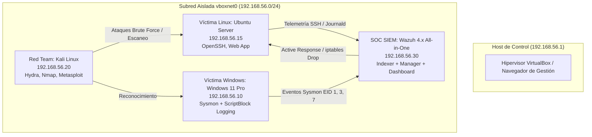
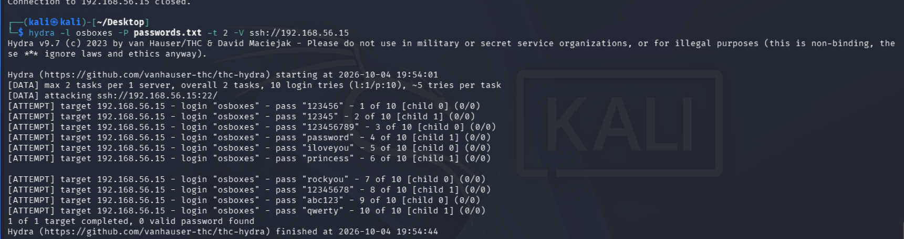
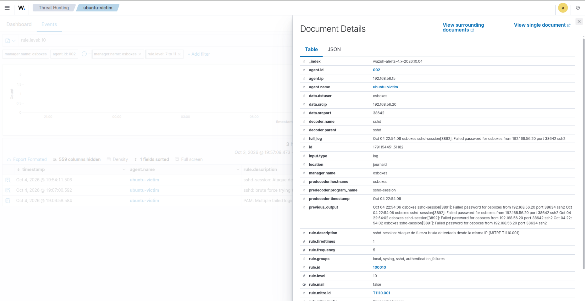
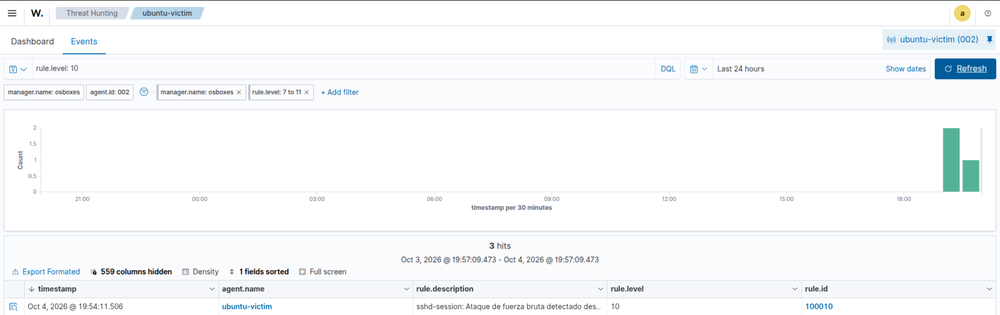
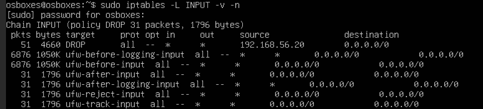

---
hide:
  - navigation
  - toc
---
# Enterprise SOC & Purple Team Simulation Lab

<div style="display: flex; gap: 6px; flex-wrap: wrap; margin-bottom: 16px;">
  <span class="tag-badge tag-badge-success">Laboratorio Práctico · Purple Team</span>
  <span class="tag-badge">Wazuh SIEM/EDR</span>
  <span class="tag-badge">MITRE ATT&CK</span>
  <span class="tag-badge">Sigma Rules</span>
  <span class="tag-badge">Microsoft Sysmon</span>
  <span class="tag-badge">Active Response</span>
  <span class="tag-badge">Hydra</span>
  <span class="tag-badge">VirtualBox</span>
</div>

<div style="display: flex; gap: 10px; flex-wrap: wrap; margin-bottom: 24px;">
  <a href="https://github.com/Jusnock/purple-team-soc-lab" target="_blank" rel="noopener" class="btn-primary">
    <svg xmlns="http://www.w3.org/2000/svg" width="15" height="15" viewBox="0 0 24 24" fill="none" stroke="currentColor" stroke-width="2" stroke-linecap="round" stroke-linejoin="round"><path d="M9 19c-5 1.5-5-2.5-7-3m14 6v-3.87a3.37 3.37 0 0 0-.94-2.61c3.14-.35 6.44-1.54 6.44-7A5.44 5.44 0 0 0 20 4.77 5.07 5.07 0 0 0 19.91 1S18.73.65 16 2.48a13.38 13.38 0 0 0-7 0C6.27.65 5.09 1 5.09 1A5.07 5.07 0 0 0 5 4.77a5.44 5.44 0 0 0-1.5 3.78c0 5.42 3.3 6.61 6.44 7A3.37 3.37 0 0 0 9 18.13V22"/></svg>
    Ver Repositorio en GitHub ↗
  </a>
  <a href="../" class="btn-secondary">
    ← Volver al Portafolio
  </a>
</div>

## Resumen del Proyecto

Laboratorio integral de ciberseguridad enfocado en la **emulación de adversarios** (Red Team), **ingeniería de detección** (*Detection-as-Code*) y análisis en **SIEM/EDR** (Blue Team) mapeado a la matriz **MITRE ATT&CK**.

El objetivo del proyecto es reproducir técnicas reales de intrusión en un entorno controlado, analizar la telemetría generada en endpoints Windows y Linux, y construir reglas de detección precisas (Sigma / Wazuh) junto con playbooks de respuesta a incidentes bajo estándar NIST SP 800-61 / SANS.

---

## Topología de Red Dual-NIC

El laboratorio se encuentra desplegado en un hipervisor **VirtualBox** utilizando una arquitectura aislada de dos interfaces por máquina para separar la gestión externa del tráfico de ataque y telemetría:

- **Adaptador 1 (NAT):** Conectividad a internet para paquetes y actualizaciones.
- **Adaptador 2 (Host-Only `vboxnet0`):** Subred privada `192.168.56.0/24` dedicada exclusivamente al tráfico de emulación, telemetría e ingesta de logs.



| Nodo | Sistema Operativo | IP Lab (`vboxnet0`) | Función |
| :--- | :--- | :--- | :--- |
| **SOC SIEM** | Ubuntu Server 24.04 | `192.168.56.30` | Ingesta de logs, correlación y Active Response |
| **Endpoint Windows** | Windows 11 Pro | `192.168.56.10` | Telemetría Sysmon y PowerShell ScriptBlock |
| **Servidor Linux** | Ubuntu Server 24.04 | `192.168.56.15` | Servicios SSH y aplicaciones emuladas |
| **Atacante** | Kali Linux | `192.168.56.20` | Emulación de adversarios controlada |

---

## Caso de Estudio 1: Ataque de Fuerza Bruta SSH (MITRE T1110.001)

### 1. Fase Ofensiva (Red Team)
Desde la máquina Kali Linux (`192.168.56.20`), se realizó un reconocimiento con `nmap` y posterior ataque de fuerza bruta sobre el servicio OpenSSH del servidor Linux (`192.168.56.15`) utilizando **Hydra**:

```bash
hydra -l osboxes -P /usr/share/wordlists/rockyou.txt ssh://192.168.56.15 -t 4
```

### 2. Detección & Telemetría (Blue Team)
En Ubuntu 24.04, los intentos fallidos de autenticación SSH son gestionados por el binario `sshd-session` en lugar del demonio clásico `sshd`. Se identificaron los logs de evento:
* `Failed password for osboxes from 192.168.56.20 port ... ssh2`

Se implementó una **regla Sigma** nativa y una **regla personalizada en Wazuh** (`local_rules.xml`, Regla 100010):

```xml
<group name="syslog,sshd,sshd-session,">
  <rule id="100010" level="10" frequency="6" timeframe="120">
    <if_matched_sid>5716</if_matched_sid>
    <same_source_ip />
    <description>Posible ataque de fuerza bruta SSH (múltiples fallos de autenticación sshd-session desde $(srcip)).</description>
    <mitre>
      <id>T1110.001</id>
      <id>T1110</id>
    </mitre>
    <group>authentication_failures,pci_dss_10.2.4,pci_dss_10.2.5,</group>
  </rule>
</group>
```

### 3. Contención Automatizada (Active Response)
Al alcanzarse el umbral de 6 intentos fallidos en 120 segundos, Wazuh dispara automáticamente un comando **Active Response** (`firewall-drop`) en el agente víctima, insertando una regla dinámica en `iptables`:

```bash
iptables -I INPUT -s 192.168.56.20 -j DROP
```

La IP atacante queda inmediatamente aislada por el tiempo configurado, cortando la conexión TCP en curso y mitigando la intrusión en tiempo real.

---

## Evidencias Técnicas & Dashboard

### 1. Ataque Hydra en Kali Linux


### 2. Disparo de Regla 100010 en Wazuh SIEM


### 3. Panel de Eventos Críticos (Nivel 10 - T1110.001)


### 4. Bloqueo Dinámico por Active Response (iptables Drop)


---

## Repositorio del Proyecto
El código fuente de las reglas Sigma, configuración de Wazuh y los Playbooks de Respuesta a Incidentes (SOPs) se encuentran en GitHub:
👉 **[github.com/Jusnock/purple-team-soc-lab](https://github.com/Jusnock/purple-team-soc-lab)**
