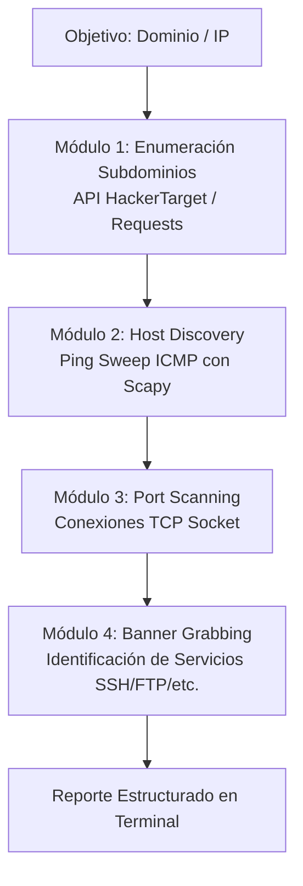

# PyRecon-Tool — Herramienta de Reconocimiento de Redes & Ciberseguridad

<div style="display: flex; gap: 8px; flex-wrap: wrap; margin-bottom: 20px;">
  <span class="badge-tag">Python 3</span>
  <span class="badge-tag">Scapy</span>
  <span class="badge-tag">Sockets TCP</span>
  <span class="badge-tag">Requests</span>
  <span class="badge-tag">Network Recon</span>
  <span class="badge-tag">Open Source</span>
</div>

<div style="margin: 20px 0;">
  <a href="https://github.com/Jusnock/PyRecon-Tool" target="_blank" class="btn-cv">
    Ver Repositorio en GitHub (PyRecon-Tool)
  </a>
</div>

## Resumen del Proyecto

**PyRecon** es una herramienta de reconocimiento (*recon*) y análisis de superficie de ataque desarrollada en **Python 3**. Automatiza en un único flujo de trabajo tareas esenciales de reconocimiento pasivo y activo: enumeración de subdominios, validación de conectividad ICMP con paquetes de bajo nivel, escaneo de puertos TCP abiertos y captura de banners de servicios (*banner grabbing*).

---

## Módulos y Flujo de Ejecución



### Capacidades Principales:
1. **Enumeración de Subdominios:** Consulta y parseo de subdominios conocidos y direcciones IP asociadas mediante integración con APIs de inteligencia de amenazas.
2. **Ping Sweep de Bajo Nivel:** Ensamblado y envío directo de paquetes **ICMP Echo Request** utilizando `scapy` para identificar hosts activos de forma precisa.
3. **Escaneo de Puertos TCP:** Conexión de bajo nivel mediante sockets para determinar el estado (*Open / Closed*) sobre listas de puertos parametrizables.
4. **Banner Grabbing:** Extracción de la respuesta inicial de servicios estándar (ej. `SSH-2.0`, `FTP`, `SMTP`) para identificar versiones de software sin interacción invasiva.

---

## Tecnologías & Librerías Utilizadas

* **Python 3:** Lenguaje principal de desarrollo y scripting de automatización.
* **`scapy`:** Forjado y manipulación de paquetes de red de bajo nivel en capa 3.
* **`socket`:** Conexiones TCP y comunicación a nivel de transporte en capa 4.
* **`requests`:** Consumo de endpoints y APIs web de reconocimiento.

---

## Modo de Uso

```bash
# Clonar e instalar dependencias en entorno virtual
git clone https://github.com/Jusnock/PyRecon-Tool.git
cd PyRecon-Tool
python3 -m venv venv && source venv/bin/activate
pip install requests scapy

# Ejecutar reconocimiento sobre objetivo
sudo venv/bin/python3 pyrecon.py -t ejemplo.com -p 21,22,80,443,8080
```
