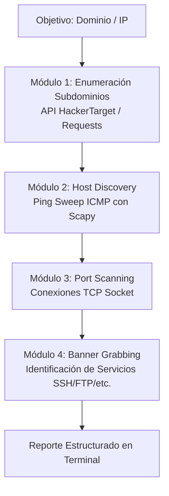

---
hide:
  - navigation
  - toc
---
# PyRecon-Tool — Network Reconnaissance CLI

<div style="display: flex; gap: 6px; flex-wrap: wrap; margin-bottom: 16px;">
  <span class="tag-badge tag-badge-accent">Herramienta CLI · Open Source</span>
  <span class="tag-badge">Python 3</span>
  <span class="tag-badge">Scapy</span>
  <span class="tag-badge">Sockets TCP</span>
  <span class="tag-badge">Network Recon</span>
  <span class="tag-badge">Banner Grabbing</span>
</div>

<div style="display: flex; gap: 10px; flex-wrap: wrap; margin-bottom: 24px;">
  <a href="https://github.com/Jusnock/PyRecon-Tool" target="_blank" rel="noopener" class="btn-primary">
    <svg xmlns="http://www.w3.org/2000/svg" width="15" height="15" viewBox="0 0 24 24" fill="none" stroke="currentColor" stroke-width="2" stroke-linecap="round" stroke-linejoin="round"><path d="M9 19c-5 1.5-5-2.5-7-3m14 6v-3.87a3.37 3.37 0 0 0-.94-2.61c3.14-.35 6.44-1.54 6.44-7A5.44 5.44 0 0 0 20 4.77 5.07 5.07 0 0 0 19.91 1S18.73.65 16 2.48a13.38 13.38 0 0 0-7 0C6.27.65 5.09 1 5.09 1A5.07 5.07 0 0 0 5 4.77a5.44 5.44 0 0 0-1.5 3.78c0 5.42 3.3 6.61 6.44 7A3.37 3.37 0 0 0 9 18.13V22"/></svg>
    Ver Repositorio en GitHub ↗
  </a>
  <a href="../" class="btn-secondary">
    ← Volver a Proyectos
  </a>
</div>

## Resumen del Proyecto

**PyRecon** es una herramienta de reconocimiento (*recon*) y análisis de superficie de ataque desarrollada en **Python 3**. Automatiza en un único flujo de trabajo tareas esenciales de reconocimiento pasivo y activo: enumeración de subdominios, validación de conectividad ICMP con paquetes de bajo nivel, escaneo de puertos TCP abiertos y captura de banners de servicios (*banner grabbing*).

---

## Módulos y Flujo de Ejecución


```mermaid
graph TD
    Domain[Objetivo: Dominio / IP] --> M1[Módulo 1: Enumeración Subdominios<br/>API HackerTarget / Requests]
    M1 --> M2[Módulo 2: Host Discovery<br/>Ping Sweep ICMP con Scapy]
    M2 --> M3[Módulo 3: Port Scanning<br/>Conexiones TCP Socket]
    M3 --> M4[Módulo 4: Banner Grabbing<br/>Identificación de Servicios SSH/FTP/etc.]
    M4 --> Report[Reporte Estructurado en Terminal]
```

### Capacidades Principales:
1. **Enumeración de Subdominios:** Consulta y parseo de subdominios conocidos y direcciones IP asociadas mediante integración con APIs de inteligencia de amenazas.
2. **Ping Sweep de Bajo Nivel:** Ensamblado y envío directo de paquetes **ICMP Echo Request** utilizando `scapy` para identificar hosts activos de forma precisa.
3. **Escaneo de Puertos TCP:** Conexión de bajo nivel mediante sockets para determinar el estado (*Open / Closed*) sobre listas de puertos parametrizables.
4. **Banner Grabbing:** Extracción de la respuesta inicial de servicios estándar (ej. `SSH-2.0`, `FTP`, `SMTP`) para identificar versiones de software sin interacción invasiva.

---

## Tecnologías & Librerías Utilizadas

* **Python 3:** Lenguaje principal de desarrollo y scripting de automatización.
* **`scapy`:** Forjado y manipulación de paquetes de red de bajo nivel en capa 3.
* **`socket`:** Conexiones TCP y comunicación a nivel de transporte en capa 4.
* **`requests`:** Consumo de endpoints y APIs web de reconocimiento.

---

## Modo de Uso

```bash
# Clonar e instalar dependencias en entorno virtual
git clone https://github.com/Jusnock/PyRecon-Tool.git
cd PyRecon-Tool
python3 -m venv venv && source venv/bin/activate
pip install requests scapy

# Ejecutar reconocimiento sobre objetivo
sudo venv/bin/python3 pyrecon.py -t ejemplo.com -p 21,22,80,443,8080
```
