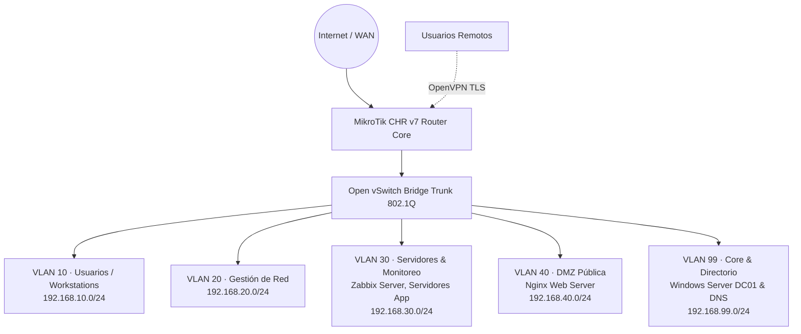

---
hide:
  - navigation
  - toc
---
# Diseño, Implementación y Seguridad de Red Empresarial Virtualizada

<div style="display: flex; gap: 6px; flex-wrap: wrap; margin-bottom: 16px;">
  <span class="tag-badge tag-badge-success">Proyecto de Grado · Memoria de 38 Págs</span>
  <span class="tag-badge">MikroTik RouterOS v7</span>
  <span class="tag-badge">Open vSwitch</span>
  <span class="tag-badge">Windows Server AD</span>
  <span class="tag-badge">Zabbix 7.0</span>
  <span class="tag-badge">OpenVPN</span>
  <span class="tag-badge">GNS3</span>
</div>

<div style="display: flex; gap: 10px; flex-wrap: wrap; margin-bottom: 24px;">
  <a href="../../assets/Proyecto-Red-Memoria-Tecnica.pdf" target="_blank" download="Proyecto-Red-Memoria-Tecnica.pdf" class="btn-primary">
    <svg xmlns="http://www.w3.org/2000/svg" width="15" height="15" viewBox="0 0 24 24" fill="none" stroke="currentColor" stroke-width="2" stroke-linecap="round" stroke-linejoin="round"><path d="M14 2H6a2 2 0 0 0-2 2v16a2 2 0 0 0 2 2h12a2 2 0 0 0 2-2V8z"/><polyline points="14 2 14 8 20 8"/><line x1="16" y1="13" x2="8" y2="13"/><line x1="16" y1="17" x2="8" y2="17"/><polyline points="10 9 9 9 8 9"/></svg>
    Descargar Memoria Técnica Completa (PDF · 38 Páginas)
  </a>
  <a href="../" class="btn-secondary">
    ← Volver a Proyectos
  </a>
</div>

## Resumen Ejecutivo

Proyecto integral de ingeniería enfocado en el diseño, despliegue, monitoreo y aseguramiento de una infraestructura de red empresarial multicapa completamente virtualizada sobre **GNS3** y **Open vSwitch (OVS)**, gobernada por un router central **MikroTik Cloud Hosted Router (CHR v7)**.

El proyecto abarca desde la segmentación lógica en VLANs y servicios de producción corporativos (Active Directory, DNS, Zabbix, DHCP corporativo) hasta políticas de filtrado stateful en firewall y acceso remoto seguro mediante **OpenVPN**.

---

## Topología de Red y Segmentación

La red se estructuró en 5 zonas de seguridad lógicamente aisladas a nivel de enlace de datos (802.1Q) y filtradas mediante políticas de mínimo privilegio en el firewall del router:



### Esquema de Direccionamiento y Roles

| Segmento | VLAN ID | Rango IP | Gateway | Propósito / Servicios |
|---|---|---|---|---|
| **Usuarios** | `VLAN 10` | `192.168.10.0/24` | `192.168.10.1` | Estaciones de trabajo de empleados corporativos |
| **Gestión** | `VLAN 20` | `192.168.20.0/24` | `192.168.20.1` | Segmento exclusivo de administración de red |
| **Servicios** | `VLAN 30` | `192.168.30.0/24` | `192.168.30.1` | Servidores Zabbix 7.0 y servicios corporativos |
| **DMZ** | `VLAN 40` | `192.168.40.0/24` | `192.168.40.1` | Servidor Web público (Nginx) expuesto vía DNAT |
| **Directorio** | `VLAN 99` | `192.168.99.0/24` | `192.168.99.1` | Controlador de Dominio (Windows Server DC01) y DNS |
| **VPN** | `ovpn-vpn` | `10.0.0.0/24` | `10.0.0.1` | Clientes remotos con túnel cifrado OpenVPN |

---

## Módulos Técnicos Implementados

### 1. Conmutación y Enrutamiento (Open vSwitch + MikroTik CHR)
* Creación de puente virtual OVS con soporte para etiquetado **IEEE 802.1Q**.
* Configuración de interfaces VLAN, servidores DHCP dedicados por segmento y tablas de enrutamiento inter-VLAN en MikroTik RouterOS v7.
* Implementación de reglas de **NAT Masquerade** hacia WAN y política por defecto *Drop All* en la cadena forward.

```routeros
# MikroTik RouterOS v7 - Configuración de Bridge VLAN y Firewall Filter
/interface bridge add name=bridge-lan vlan-filtering=yes
/interface vlan
add interface=bridge-lan name=vlan10-usuarios vlan-id=10
add interface=bridge-lan name=vlan20-gestion vlan-id=20
add interface=bridge-lan name=vlan30-servicios vlan-id=30
add interface=bridge-lan name=vlan40-dmz vlan-id=40
add interface=bridge-lan name=vlan99-directorio vlan-id=99

# Políticas de Firewall (Stateful & Mínimo Privilegio)
/ip firewall filter
add chain=input connection-state=established,related action=accept comment="Aceptar conexiones establecidas"
add chain=input connection-state=invalid action=drop comment="Descartar paquetes invalidos"
add chain=input protocol=icmp action=accept comment="Permitir ping diagnostico"
add chain=input in-interface=vlan20-gestion action=accept comment="Acceso de gestion exclusivo VLAN 20"
add chain=input action=drop comment="Bloquear todo otro acceso al router"

add chain=forward connection-state=established,related action=accept
add chain=forward connection-state=invalid action=drop
add chain=forward in-interface=vlan10-usuarios out-interface=ether1 action=accept comment="Salida a Internet"
add chain=forward in-interface=vlan10-usuarios out-interface=vlan99-directorio dst-port=53,88,389,445 protocol=tcp action=accept comment="Acceso a AD DS y DNS"
add chain=forward in-interface=vlan40-dmz out-interface=!ether1 action=drop comment="Aislar DMZ de redes internas"
add chain=forward action=drop comment="Bloquear resto de trafico inter-VLAN"
```

### 2. Servicios Corporativos de Identidad y Acceso
* **Active Directory Domain Services (AD DS):** Despliegue de Windows Server DC01, diseño de árbol de Unidades Organizativas (OUs), altas de usuarios y grupos por departamento.
* **DNS Corporativo:** Resolución de nombres internos para el dominio corporativo y reenviadores condicionales (*DNS Forwarders*) a Internet.
* **Directivas de Grupo (GPOs):** Aplicación de políticas centralizadas para endurecimiento de estaciones, configuración de proxy y control de unidades de red.

### 3. Monitoreo y Visibilidad de Infraestructura
* **Zabbix 7.0 LTS:** Monitorización centralizada de salud de red y servidores mediante agentes Zabbix y consultas SNMP hacia el core router MikroTik.
* **WinGate Proxy HTTP:** Control y registro de navegación web para las estaciones de trabajo de usuarios.

### 4. Seguridad de Red y Filtrado Perimetral
* **Políticas de Firewall Stateful:** Reglas de conexión en MikroTik RouterOS permitiendo solo tráfico establecido/relacionado y bloqueando paquetes inválidos o no autorizados.
* **Aislamiento de Zonas:** Segmentación estricta entre VLANs impidiendo que estaciones de trabajo accedan a puertos administrativos o de gestión.
* **Control de Acceso Administrativo:** Restricción de servicios de administración (WinBox, SSH) accesibles únicamente desde la VLAN de gestión.

### 5. Publicación en DMZ y Acceso Remoto con OpenVPN
* **Aislamiento de DMZ:** Servidor Nginx en VLAN 40 con redirección de puertos (DNAT tcp/80) y regla de bloqueo explícita hacia las subredes internas.
* **Túnel VPN Corporativo (OpenVPN):** Servidor VPN sobre RouterOS con cifrado TLS y certificados para teletrabajo seguro de colaboradores remotos.

---

## Validación y Pruebas de Seguridad (Pentesting)

El entorno fue auditado ofensivamente desde una máquina **Kali Linux** para verificar la eficacia de los controles:

1. **Aislamiento Inter-VLAN:** Verificación de que escaneos de red (`nmap`) desde VLAN 10 no alcanzan servicios de gestión (VLAN 20) ni el core de servidores (VLAN 30/99).
2. **Defensa perimetral en RouterOS:** Reglas de *Rate Limiting* y bloqueo ante escaneos de puertos y paquetes TCP anómalos.
3. **Validación de Túneles VPN:** Confirmación de establecimiento de sesión segura cifrada y verificación del aislamiento de clientes remotos respecto a redes internas sensibles.
