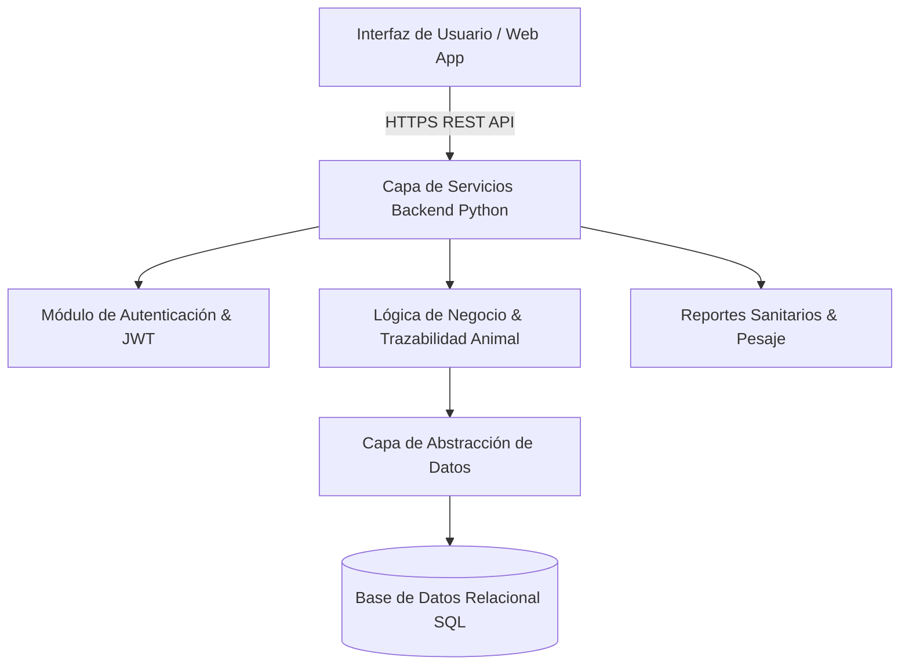

# 🐄 Syscow — Plataforma Integral de Gestión Agropecuaria

  Proyecto Tesis UTN FRM
  Python & REST APIs
  SQL Database
  Arquitectura Modular

## 📌 Resumen del Proyecto

**Syscow** es el proyecto integrador final de grado desarrollado para la carrera de **Ingeniería en Sistemas de Información en la Universidad Tecnológica Nacional (UTN FRM)**.

El sistema resuelve la problemática de trazabilidad, control sanitario, gestión de rodeos y seguimiento operativo en establecimientos agropecuarios y ganaderos.

* **Repositorio:** [github.com/Jusnock](https://github.com/Jusnock)
* **Institución:** UTN Facultad Regional Mendoza

---

## 🏛️ Arquitectura del Sistema

El proyecto fue diseñado bajo una arquitectura desacoplada y orientada a servicios:

---

## 🔑 Características Técnicas Principales

1. **Gestión de Ciclo de Vida Animal:** Registro de nacimientos, categorización de animales, pesajes históricos y curvas de rendimiento.
2. **Historial Clínico y Sanitario:** Registro de vacunaciones obligatorias, tratamientos veterinarios y alertas de períodos de retiro medicamentoso.
3. **Control de Acceso por Roles (RBAC):** Separación de permisos para administradores de campo, veterinarios y auditores.
4. **Optimización de Consultas SQL:** Índices estratégicos sobre identificadores de caravanas electrónicas (RFID) y marcas de tiempo para garantizar respuestas en milisegundos.
