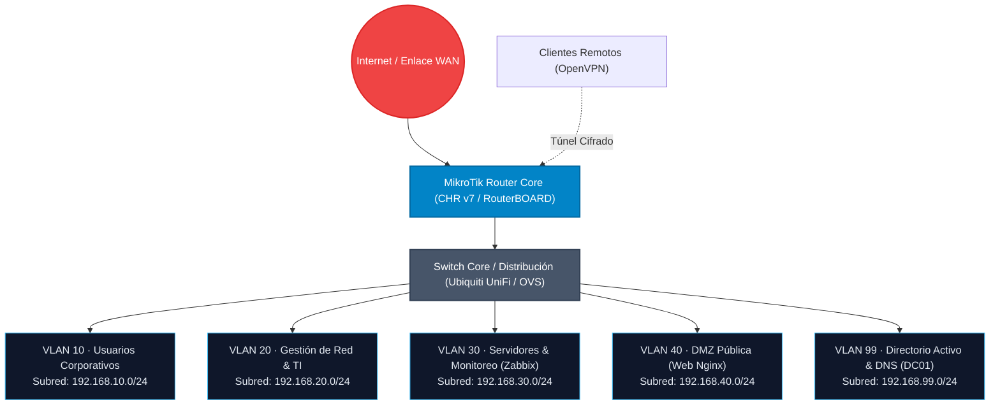

# Redes e Infraestructura Corporativa

Documentación técnica sobre metodologías de diseño de red, gestión de equipamiento MikroTik y Ubiquiti, esquemas de segmentación segura y directivas de administración aplicadas en entornos empresariales reales y de laboratorio.

---

## Principios de Diseño & Arquitectura

El enfoque de diseño de infraestructura se basa en los principios de **mínimo privilegio de red**, **alta redundancia** y **visibilidad total del tráfico**:

1. **Segmentación Lógica (VLANs 802.1Q):** Separación estricta de dominios de difusión según el rol del dispositivo (usuarios corporativos, administración de TI, servidores de producción, DMZ pública).
2. **Filtrado Stateful en Núcleo:** Cada router actúa como cortafuegos perimetral e inter-VLAN. Se aplican reglas de filtrado de estado de conexión (*Drop Invalid*, *Accept Established/Related*, *FastTrack Connection* para tráfico de alto rendimiento).
3. **Acceso Remoto Cifrado:** Reemplazo de accesos desprotegidos por túneles corporativos **OpenVPN** con certificados TLS y autenticación robusta.
4. **Monitoreo Proactivo de Salud de Red:** Supervisión constante de ancho de banda, consumo de CPU, pérdida de paquetes y estado de interfaces mediante **Zabbix 7.0 (SNMP v2c/v3)**.

---

## Topología de Referencia Multicapa

La siguiente topología ilustra la arquitectura de referencia implementada para entornos empresariales seguros:

---

## Competencias Técnicas por Plataforma

  

    <h4 class="skill-card-title">MikroTik RouterOS (v6 & v7)</h4>
    <ul class="skill-list">
      <li><strong>Bridge VLAN Filtering:</strong> Configuración moderna de switching hardware-offloaded en RouterOS v7.</li>
      <li><strong>Firewall Filter & NAT:</strong> Reglas de protección perimetral, defensa contra escaneos de puertos y reglas SRC-NAT/DST-NAT.</li>
      <li><strong>Enrutamiento:</strong> Rutas estáticas con check-gateway (failover de enlaces y balanceo).</li>
      <li><strong>Túneles & VPNs:</strong> Configuración de túneles OpenVPN Server/Client y conexiones seguras punto a punto.</li>
      <li><strong>QoS & Queues:</strong> Simple Queues para priorización de tráfico crítico y control de ancho de banda.</li>
    </ul>
  

  

    <h4 class="skill-card-title">Ubiquiti UniFi Ecosystem</h4>
    <ul class="skill-list">
      <li><strong>UniFi Network Controller:</strong> Despliegue, adopción y aprovisionamiento centralizado de dispositivos.</li>
      <li><strong>VLANs & Trunks:</strong> Configuración de puertos de switches en modo Access y Trunk (Port Profiles).</li>
      <li><strong>Wireless Corporativo:</strong> SSIDs empresariales mapeados a VLANs con autenticación WPA2/WPA3.</li>
      <li><strong>Portal de Invitados:</strong> Aislamiento de capa 2 (Client Isolation) y limitación de ancho de banda para visitas.</li>
    </ul>
  

  

    <h4 class="skill-card-title">Servicios Críticos de Red</h4>
    <ul class="skill-list">
      <li><strong>Active Directory Domain Services:</strong> Integración de servicios DNS corporativos y zonas directas/inversas.</li>
      <li><strong>Gestión de Direccionamiento:</strong> Servidores DHCP dedicados por VLAN con asignaciones estáticas (reservas IP/MAC).</li>
      <li><strong>Seguridad en Capa 2:</strong> DHCP Snooping para mitigar servidores DHCP no autorizados.</li>
    </ul>
  

  

    <h4 class="skill-card-title">Monitoreo & Telemetría</h4>
    <ul class="skill-list">
      <li><strong>Zabbix 7.0:</strong> Supervisión de interfaces de red vía SNMP v2c/v3 con plantillas especializadas.</li>
      <li><strong>Alertas & Triggers:</strong> Notificaciones automatizadas ante caídas de enlaces o consumo anómalo.</li>
      <li><strong>Wireshark:</strong> Captura y análisis profundo de tramas para diagnóstico de latencia y retransmisiones.</li>
    </ul>
  

---

## Caso de Estudio Destacado

Para conocer en detalle la implementación completa de una red empresarial virtualizada con MikroTik CHR v7, 5 VLANs, Open vSwitch y Active Directory:

  <a href="proyectos/red-empresarial-virtualizada.md" class="btn-primary">
    Ver Caso de Estudio: Red Empresarial Virtualizada →
  </a>
  <a href="../assets/Proyecto-Red-Memoria-Tecnica.pdf" target="_blank" download="Proyecto-Red-Memoria-Tecnica.pdf" class="btn-secondary">
    <svg xmlns="http://www.w3.org/2000/svg" width="15" height="15" viewBox="0 0 24 24" fill="none" stroke="currentColor" stroke-width="2" stroke-linecap="round" stroke-linejoin="round"><path d="M14 2H6a2 2 0 0 0-2 2v16a2 2 0 0 0 2 2h12a2 2 0 0 0 2-2V8z"/><polyline points="14 2 14 8 20 8"/><line x1="16" y1="13" x2="8" y2="13"/><line x1="16" y1="17" x2="8" y2="17"/><polyline points="10 9 9 9 8 9"/></svg>
    Descargar Memoria Técnica (PDF · 38 Páginas)
  </a>

