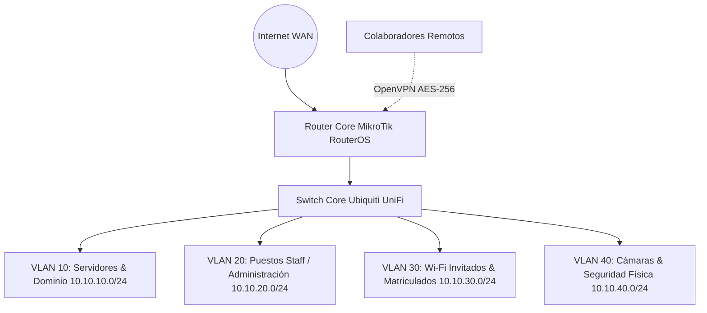

# 🌐 Caso de Estudio: Topología de Red y VPN Corporativa (CPCE)

<div style="display: flex; gap: 8px; margin-bottom: 20px;">
  <span class="badge-tag">MikroTik RouterOS</span>
  <span class="badge-tag">Ubiquiti UniFi</span>
  <span class="badge-tag">VLAN Segmentation</span>
  <span class="badge-tag">OpenVPN Tunnel</span>
</div>

## 📌 Contexto & Requerimiento

El **Consejo Profesional de Ciencias Económicas (CPCE)** requería una infraestructura de red robusta, escalable y segura para dar soporte a decenas de colaboradores internos, terminales de autoservicio para matriculados, accesos Wi-Fi para invitados y enlaces seguros de acceso remoto para teletrabajo.

---

## 🏛️ Arquitectura de Red y Segmentación por VLANs

Para mitigar riesgos de movimiento lateral y broadcast storm, la red física se dividió lógicamente en múltiples **Virtual LANs (VLANs)** con políticas de acceso y reglas de firewalling estrictas en el core router:



### Tabla de Segmentación

| VLAN ID | Segmento | Propósito | Acceso a Servidores | Salida a Internet |
|---|---|---|---|---|
| **VLAN 10** | `10.10.10.0/24` | Servidores Core (AD, DNS, DB) | Total (Local) | Restringida |
| **VLAN 20** | `10.10.20.0/24` | Workstations de personal | Puertos específicos (Kerberos, SMB, RDP) | Permitida (Proxy/Filter) |
| **VLAN 30** | `10.10.30.0/24` | Wi-Fi Invitados / Matriculados | ❌ Bloqueado por Firewall | Permitida |
| **VLAN 40** | `10.10.40.0/24` | NVR & Cámaras de Vigilancia | ❌ Bloqueado | ❌ Bloqueado |

---

## ⚙️ Configuración Destacada en MikroTik RouterOS

### 1. Reglas de Filtrado Inter-VLAN (Bloqueo de Tráfico no Autorizado)

```routeros
# Regla para evitar que la red de invitados acceda a la red de servidores
/ip firewall filter
add action=drop chain=forward comment="Bloqueo Guest a Servidores" \
    in-interface=vlan30-guest out-interface=vlan10-servers

# Permitir únicamente tráfico establecido y relacionado
add action=accept chain=forward comment="Permitir conexiones establecidas" \
    connection-state=established,related
```

### 2. Despliegue de Servidor OpenVPN Seguro

Se configuró un servidor OpenVPN en RouterOS con autenticación por certificados TLS y cifrado robusto:

```routeros
/interface ovpn-server server
set auth=sha256 cipher=aes256 default-profile=ovpn-profile \
    enabled=yes mode=ip netmask=24 port=1194 require-client-certificate=yes
```

---

## 🛡️ Lecciones Aprendidas y Buenas Prácticas

1. **Aislamiento de Perímetro:** La segregación estricta de VLANs evita que un dispositivo comprometido en la red Wi-Fi de invitados pueda escanear puertos en los controladores de dominio.
2. **QoS (Quality of Service):** Se asignó prioridad de ancho de banda a los servicios críticos de gestión y telefonía IP frente al tráfico general de navegación.
3. **Monitoreo Continuo:** Implementación de logs centralizados para detectar intentos anómalos de conexión o escaneos de puertos en el gateway.
